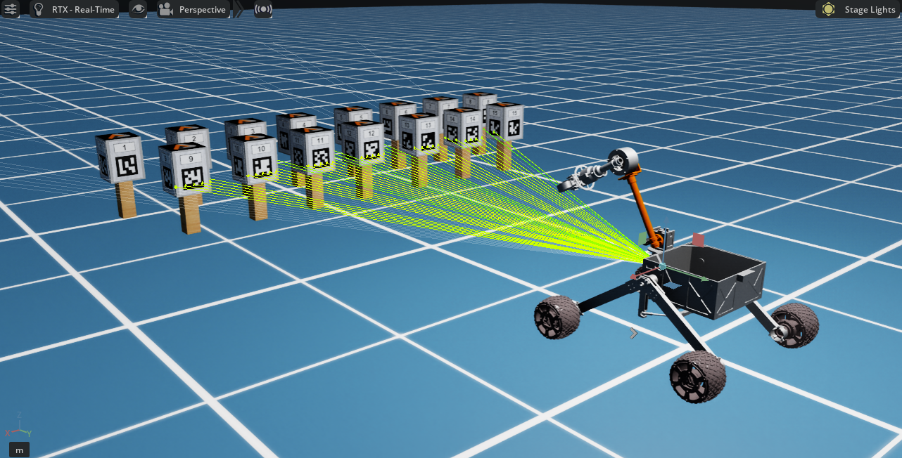
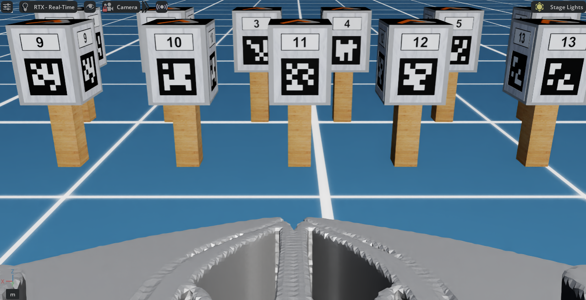
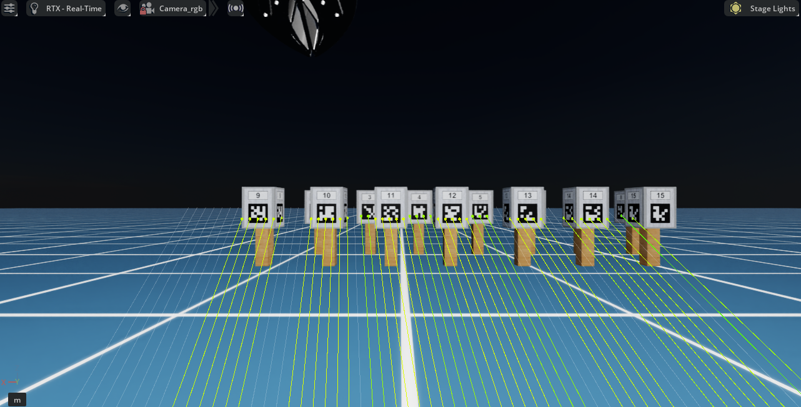
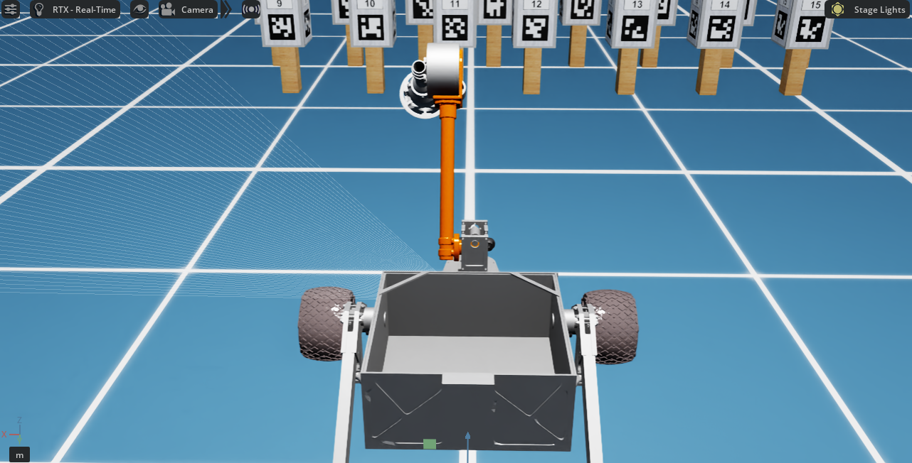
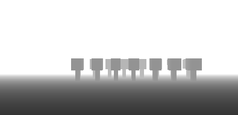
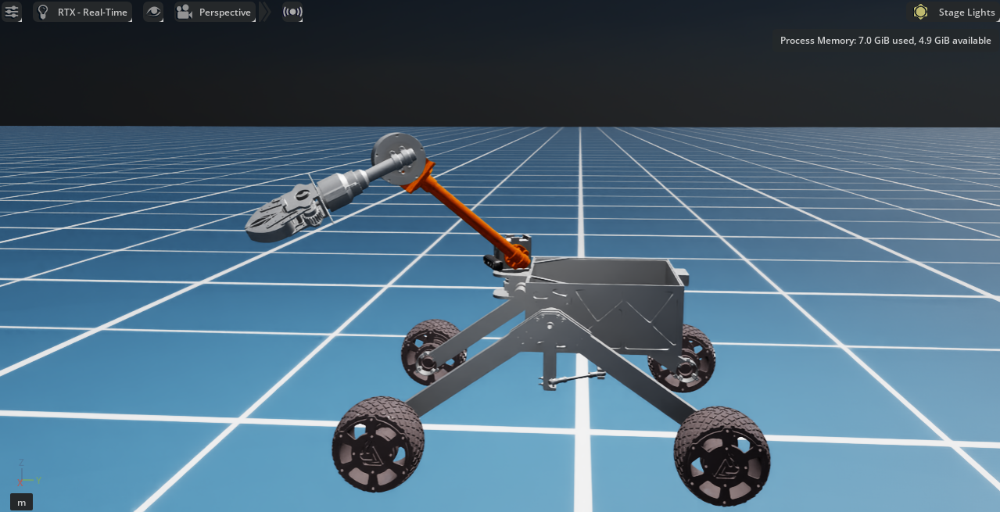
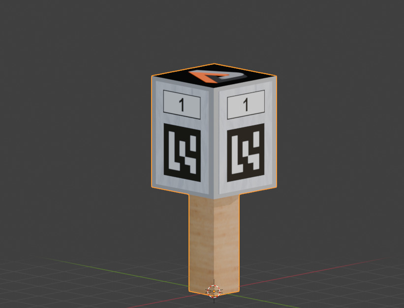

Rover Hubble Isaac Simulation

A high-fidelity **autonomous rover simulation** built in NVIDIA Isaac Sim, designed for perception, manipulation, and navigation tasks aligned with **TEAM ANVESHAK'S** requirements.

This repository provides a **lightweight, reproducible setup** where heavy assets are downloaded on demand.

---

## Simulation Overview

- **Multi-Sensor Simulation**
  - 180° Front LiDAR
        
  - 3 RGB Cameras:
    - Gripper camera
        
    - Base camera
        
    - Third-person view (TPV)
        
  - Depth Camera
        

- **Manipulation System**
  - Arm control with encoder feedback
        
  - Gripper camera for precision tasks

- **ERC-Style Perception**
  - Custom **Aruco marker Holder**
        

- **ROS2 Integration**
  - Real-time topic communication

- **Reproducible Setup**
  - Assets downloaded via script

---

## Project Structure

```
Rover-Hubble-Isaac-Simulation/
│── sim_assets/
│   ├── meshes/
│   ├── textures/
│   ├── python_script/
│
│── scripts/
│   └── setup_assets.sh
│
│── docs/
│── hubble.usd
│── aruco_stand.usdc
│── hubble_ws/
│── README.md
│── LICENSE
```

---

## Quick Start

```bash
git clone https://github.com/Avg2006/Rover-Hubble-Isaac-Simulation.git
cd Rover-Hubble-Isaac-Simulation
bash scripts/setup_assets.sh
```

---

## Running the Simulation

1. Open NVIDIA Isaac Sim
2. Load:
   hubble.usd

---

## ROS2 Integration

### Step 1 — Set Domain ID

```bash
export ROS_DOMAIN_ID=5
```

### Step 2 — Start ROS2 Bridge in Isaac Sim

### Step 3 — Verify Topics

```bash
ros2 topic list
```

---

## ROS2 Topics

| Topic | Direction | Description |
|------|----------|------------|
| /arm_enc | Output | Arm encoder feedback |
| /cmd_arm_pos | Input | Command arm position |
| /motor_pwm | Input | Wheel + steering control |
| /odom | Output | Rover odometry |
| /rgbd_camera/image_raw | Output | Base RGB camera |
| /rgbd_camera/depth_image | Output | Depth camera |
| /rgbd_camera/camera_info | Output | RGB camera info |
| /rgbd_camera/depth_camera_info | Output | Depth camera info |
| /griper_cam/image_raw | Output | Gripper camera feed |
| /griper_cam/camera_info | Output | Gripper camera info |
| /tpv_cam/image_raw | Output | Third-person camera |
| /scan or /sim/laser_scan | Output | 180° LiDAR scan |

---

## Notes

- Large assets are not stored in GitHub
- Downloaded automatically via setup script

---

## Requirements

- Ubuntu 20.04 / 22.04
- Python 3.8+
- NVIDIA Isaac Sim
- ROS2 Humble

---

## Author

Akhand Veer Garg  
IIT Madras – Aerospace Engineering
akhandveergarg@gmail.com